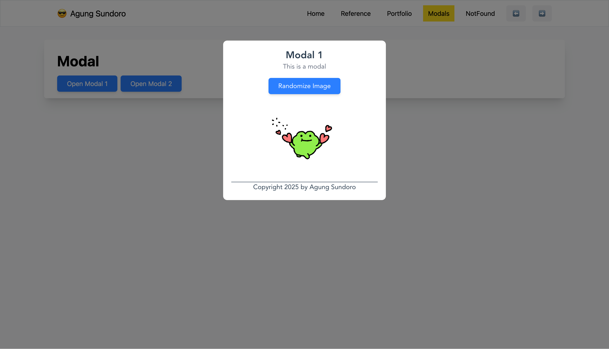

# Learn Vue JS

## Install vue and create project

- Clone the repository : `git clone https://github.com/matt-west/modal-project.git`
- Install Vue CLI : `npm install -g @vue/cli`
- Create a new project : `vue create {project-name}`

## Modal/Popup Project

This project is a simple modal/popup project that uses Vue 3 and Tailwind CSS.
This project has some advanced features like :

- Dynamic routes using vue-router including 404 page
- Modal/Popup components with delay and transition
- Posts page with fetch from jsonplaceholder
- Post page with fetch from jsonplaceholder
- Tasks page with pinia store
- Pinia store with async actions
- Reference page displaying input element with ref
- Watch page displaying watch and watchEffect

### Installation

- Run `cd modal-project`
- Run `pnpm install`
- Run `pnpm serve`

## Resources

- [Pinia Documentation](https://pinia.vuejs.org/)
- [Tailwind CSS](https://tailwindcss.com/)
- [Vue Official Website](https://vuejs.org/)
- [Vue 3 Documentation](https://vuejs.org/guide/introduction.html)
- [Vue 3 API](https://v3.vuejs.org/api/)
- [W3Schools Vue](https://www.w3schools.com/vue/)

## Tutorial

### Net Ninja

- [Vue 3 Crash Course](https://www.youtube.com/watch?v=YrxBCBibVo0&list=PL4cUxeGkcC9hYYGbV60Vq3IXYNfDk8At1)
- [Piniat Crash Course](https://www.youtube.com/watch?v=u0B9dysw29A&list=PL4cUxeGkcC9hp28dYyYBy3xoOdoeNw-hD)
