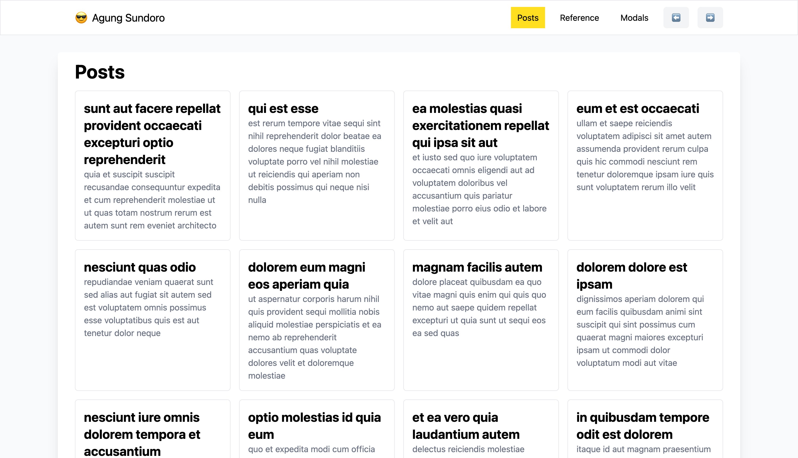

# Learn Vue JS

## Install vue and create project
- Clone the repository : `git clone https://github.com/matt-west/modal-project.git`
- Install Vue CLI : `npm install -g @vue/cli`
- Create a new project : `vue create {project-name}`

## Install modal-project
- Run `cd modal-project`
- Run `pnpm install`
- Run `pnpm serve`

## Resources
- [Vue Official Website](https://vuejs.org/)
- [Vue 3 Documentation](https://vuejs.org/guide/introduction.html)
- [Vue 3 API](https://v3.vuejs.org/api/)
- [Tailwind CSS](https://tailwindcss.com/)
- [W3Schools Vue](https://www.w3schools.com/vue/)